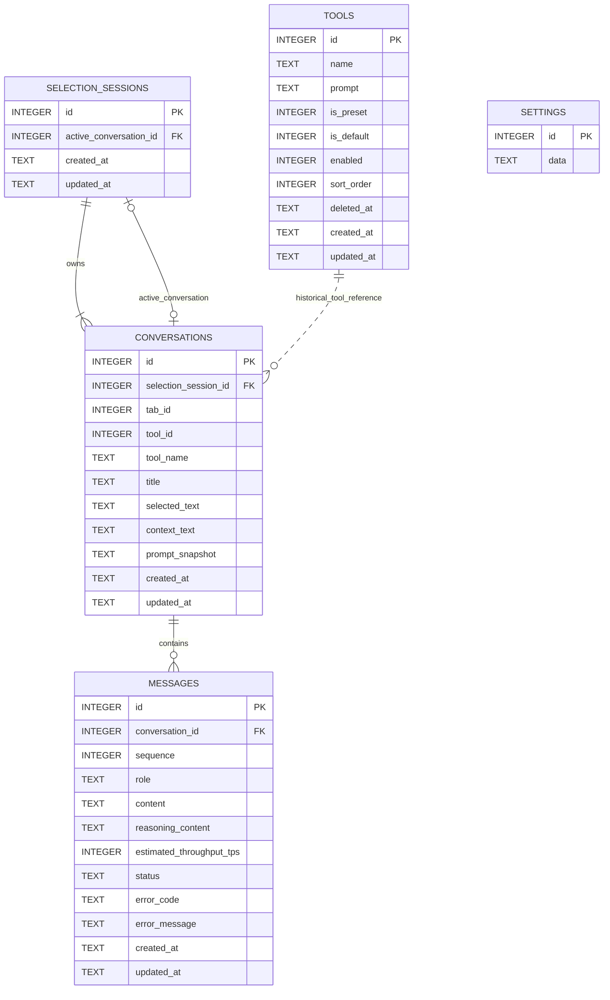

# Tab UI Session Coordinator Design

## Status

Approved in design review on 2026-08-27.

## Goal

Make Background the single authority that routes selected text, UI lifecycle changes, panel toggles, and tool shortcuts between the Content Script UI and the global Chrome Side Panel. For each tab and normalized page URL, exactly one surface may own the latest selected-text session.

The design also replaces the implicit `selection_key` conversation group with an explicit SQLite `selection_sessions` aggregate. A tab session then needs only a `selectionSessionId` to restore the active conversation and every previously used tool conversation.

## Scope

This design covers:

- session-scoped tab/page identity using `tabId + normalized URL`;
- Content UI and Side Panel appeared/destroyed tracking;
- latest-surface restoration with `Ctrl + [`;
- selected-text routing to exactly one rendering surface;
- direct and directional tool shortcuts from either surface;
- global Side Panel behavior across active-tab changes;
- typed cross-context communication through `src/events`;
- the `selection_sessions` schema, migration, database operations, and deletion behavior;
- safe diagnostic logging and automated/browser verification.

## Non-goals

- Restoring tab/UI ownership after the entire browser restarts.
- Adding a durable page identity such as a workspace token.
- Saving anchor rectangles across reloads.
- Supporting multiple simultaneous selected-text sessions in one tab.
- Supporting multiple conversations for the same tool inside one selection session.
- Replacing settings, database RPC, or high-frequency streaming-update event domains.

`chrome.storage.session` remains the recovery store for Background Service Worker suspension. Browser restart clears it; persistent selection sessions without a matching live tab session are removed during startup reconciliation.

## Invariants

1. One selection creates one Background operation, one selection session, one provider run, and one rendering owner.
2. Content UI and Side Panel never simultaneously own the active tab's session.
3. When a global Side Panel is appeared, it owns the active tab.
4. `latestUI` survives surface destruction and controls the next `Ctrl + [` restoration.
5. UI presence is runtime evidence, not a SQLite fact.
6. Background derives trusted `tabId`, `windowId`, and page URL from Chrome metadata rather than accepting them from Content Script payloads.
7. One selection session has at most one conversation per tool.
8. All state-changing UI operations for one tab execute serially.

## Architecture

### UI session coordinator

Add a focused Background `UiSessionCoordinator`. It owns browser/UI state and routes events, but delegates conversation work.

Responsibilities:

- maintain tab/page and window-panel maps;
- restore the tab map from `chrome.storage.session` after Service Worker suspension;
- serialize state-changing operations per tab;
- normalize and compare page URLs;
- route selection and shortcut requests;
- invoke Chrome Side Panel APIs;
- react to tab activation, navigation, and removal;
- send typed Content UI and Side Panel instructions;
- persist committed tab-session changes.

### Conversation manager

`ConversationManager` remains responsible for:

- selection-session creation and loading;
- tool-conversation creation and activation;
- provider-run start/stop;
- live snapshots and streaming publication;
- selection-session deletion.

Current panel ownership, handoff, and browser-window responsibilities move out of `ConversationManager` into `UiSessionCoordinator`. This prevents one module from owning both chat execution and browser UI arbitration.

### Event layer

All application components import named, typed events from `src/events/config.ts`. Raw `chrome.runtime.sendMessage`, `chrome.tabs.sendMessage`, and long-lived Side Panel port messages remain inside `src/events` infrastructure or Background Chrome adapters.

The existing `cs2bg`, `ep2bg`, and targeted `bg2cs` patterns remain. Background-to-Side-Panel delivery uses a typed event wrapper around the registered long-lived Side Panel port so the correct browser window is targeted. Generic `bg2ep` broadcast is not used for targeted panel commands.

## Runtime state

```ts
type UiSurface = 'contentScript' | 'sidePanel'

interface TabSessionState {
  tabId: number
  windowId: number
  pageUrl: string
  contentUIAppeared: boolean
  latestUI: UiSurface
  selectionSessionId: number | null
}

interface WindowPanelState {
  windowId: number
  appeared: boolean
  activeTabId: number | null
  portConnected: boolean
}
```

`TabSessionState` is cached in `Map<number, TabSessionState>` and serialized to `chrome.storage.session`. `WindowPanelState` is runtime-only because panel presence must be reconstructed from `sidePanel.onOpened`, `sidePanel.onClosed`, and the Side Panel event-port lifecycle.

The tab state does not duplicate `selectionKey`, active conversation, active tool, or used tool IDs. Those values are restored from `selectionSessionId` through SQLite.

## Page identity

The identity is:

```text
tabId + normalize(committed main-frame URL)
```

Normalization keeps `origin + pathname + search` and removes the fragment. Therefore:

- reloading the same normalized URL preserves `latestUI` and `selectionSessionId`;
- a hash-only change preserves the session;
- a pathname or query change replaces the page session;
- navigation in the same tab stops the old provider run, deletes its selection session, resets UI state, and clears the active Side Panel view when applicable.

On Content Script bootstrap, it reports Content UI as `destroyed`. If page identity still matches, Background clears only `contentUIAppeared`; it preserves `latestUI` and `selectionSessionId`.

## Event contracts

The logical event names are intentionally action-oriented:

```text
ui.surfaceStatus
selection.route
shortcut.panelToggle
shortcut.selectTool
shortcut.cycleTool
contentUi.destroy
sidePanel.command
```

Content Script and Side Panel may expose separate configured event objects for their transports, but shortcut sources share the same domain request/result types and logical names.

### Surface status

```ts
type SurfaceStatusRequest = {
  status: 'appeared' | 'destroyed'
  selectionSessionId: number | null
}

type SurfaceStatusResponse = {
  currentUI: UiSurface | 'none'
  latestUI: UiSurface
  selectionSessionId: number | null
}
```

Content Script reports only UI appearance/destruction; it does not send `tabId` or URL. Side Panel status is bound to its registered window and active tab.

Destroying a surface sets its current presence to false but does not change `latestUI`.

### Selection routing

```ts
type SelectionRouteRequest = {
  selectedText: string
  contextText: string
}

type SelectionRouteResult =
  | {
      target: 'contentScript'
      display: true
      snapshot: ConversationSnapshot
    }
  | {
      target: 'sidePanel'
      display: false
      snapshot: null
    }
```

The Content Script retains its local anchor only for rendering. Background validates identity, stops and deletes the tab's previous selection session, creates the replacement session, appends the initial assistant message, and starts the provider exactly once.

If the global Side Panel is appeared in the sender's window, Background sends `sidePanel.command({ type: 'render', snapshot })` and waits for delivery acknowledgement before returning the `sidePanel` result. Otherwise, it returns the snapshot to Content Script and records Content UI as appeared/latest.

If Side Panel delivery fails, Background marks the panel destroyed and returns the already-created snapshot to Content Script. It never creates another session or starts another provider run.

### Panel toggle shortcut

`shortcut.panelToggle` is the single logical event for `Ctrl + [`, regardless of whether Content Script or Side Panel captures it.

| Current state                       | Transition                                                       | Result                                         |
| ----------------------------------- | ---------------------------------------------------------------- | ---------------------------------------------- |
| Content UI appeared                 | Open Side Panel, render current session, destroy Content UI      | `latestUI = sidePanel`                         |
| Side Panel appeared                 | Background calls `chrome.sidePanel.close({ windowId })` directly | both destroyed; `latestUI` remains `sidePanel` |
| Neither appeared; latest Content    | Return the latest session snapshot to Content Script             | Content reports appeared                       |
| Neither appeared; latest Side Panel | Background opens Side Panel and sends render/clear               | Content does not render                        |

Background does not send a Side Panel `close` command. The Chrome close operation is authoritative; `sidePanel.onClosed` or port disconnect confirms destruction and updates `WindowPanelState`.

If stale state claims both surfaces appeared, Side Panel wins. Background sends `contentUi.destroy`, records Content UI destroyed, and keeps `latestUI = sidePanel`.

When a global panel opens, Background proactively sends `contentUi.destroy` to every tab in that window whose Content UI is appeared. Inactive tabs retain their prior `latestUI`; a tab changes to `latestUI = sidePanel` only when the open panel activates/renders that tab.

### Tool shortcuts

```ts
type SelectToolShortcutRequest = { index: number }
type CycleToolShortcutRequest = { direction: 'left' | 'right' }

type ToolShortcutResult =
  | { handled: false; reason: 'NO_APPEARED_UI' | 'TOOL_UNAVAILABLE' }
  | { handled: true; target: UiSurface; snapshot: ConversationSnapshot | null }
```

Rules:

- When neither UI is appeared, both shortcuts are ignored.
- When Content UI owns the tab, Background activates the tool conversation and returns its snapshot to Content Script.
- When Side Panel owns the tab and initiated the shortcut, the response directly contains the updated snapshot.
- When Content Script initiated the shortcut but Side Panel owns the tab, Background sends the snapshot through `sidePanel.command`; the Content response reports `target: sidePanel` with no local snapshot.
- A successful switch updates `selection_sessions.active_conversation_id` in the same serialized operation.

### Outbound UI commands

```ts
type ContentUiCommand = { type: 'destroy' }

type SidePanelCommand =
  | { type: 'render'; snapshot: ConversationSnapshot }
  | { type: 'clear' }
  | { type: 'selectTool'; snapshot: ConversationSnapshot }
```

There is no Side Panel `close` command.

High-frequency `stream.*` conversation updates retain their existing channel and are routed only to the current owner/subscriber. Settings and database RPC events remain independent.

## Active-tab behavior

When `chrome.tabs.onActivated` fires:

1. Background updates the window's `activeTabId`.
2. It reads the active tab URL and reconciles page identity.
3. If the global Side Panel is destroyed, no surface is automatically opened.
4. If the Side Panel is appeared, Background destroys an appeared Content UI for that tab.
5. If the tab has a `selectionSessionId`, Background loads and renders it in Side Panel and records `latestUI = sidePanel`.
6. Otherwise, Background sends `sidePanel.command({ type: 'clear' })` and shows the empty component.

## SQLite model

The application database contains `selection_sessions`, `conversations`, `messages`, `tools`, and `settings`.



### Table responsibilities

- `selection_sessions`: aggregate root for one selected-text workspace; stores the currently active tool conversation.
- `conversations`: one tool-specific chat in a selection session; retains selected/context text plus tool-name and prompt snapshots.
- `messages`: ordered user/assistant turns, streaming lifecycle, errors, reasoning, and final estimated throughput.
- `tools`: current preset/custom definitions, order, enabled/default state, and soft-removal state.
- `settings`: singleton JSON configuration document (`id = 1`).

`conversations.tool_id` remains a logical reference rather than a foreign key. Historical conversations remain readable after a tool is edited or removed because `tool_name` and `prompt_snapshot` preserve what was used.

The web-sqlite library's `release` and `release_lock` tables live in a separate metadata database and have no application-domain relationships.

### Constraints and deletion

```sql
UNIQUE (selection_session_id, tool_id)
UNIQUE (conversation_id, sequence)
```

Foreign-key behavior:

```text
selection_sessions --1:N, ON DELETE CASCADE--> conversations
conversations      --1:N, ON DELETE CASCADE--> messages
selection_sessions.active_conversation_id --ON DELETE SET NULL--> conversations.id
```

One tool conversation per session is enforced at write time; restore queries do not deduplicate duplicate tool IDs.

## Database operations

Replace selection-key-oriented RPC with:

```text
createSelectionSession
getSelectionSession
ensureToolConversation
setActiveConversation
deleteSelectionSession
deleteOrphanSelectionSessions
```

- `createSelectionSession` creates the session, first conversation, first user message, and active-conversation pointer atomically.
- `getSelectionSession` loads all tool conversation references and the active conversation's messages.
- `ensureToolConversation` returns the unique existing tool conversation or creates it from the session's selected/context source.
- `setActiveConversation` validates membership before changing the pointer.
- `deleteSelectionSession` cascades through conversations and messages.
- `deleteOrphanSelectionSessions` removes persistent sessions not referenced by valid restored tab state, including after a browser restart that clears `chrome.storage.session`.

## Migration

Add schema release `2.3.0`.

Migration behavior:

1. Stage one active root ID for every existing `selection_key`. Existing data guarantees root conversation `id = selection_key`.
2. Create `selection_sessions`, initially with nullable active pointers.
3. Insert one session per existing selection group, preserving the old selection key as the new session ID.
4. Rebuild `conversations` with `selection_session_id`, remove `selection_key`, and add `UNIQUE(selection_session_id, tool_id)`.
5. Rebuild/preserve `messages` so its foreign key targets the rebuilt conversations table.
6. Populate `active_conversation_id` from the staged root IDs.
7. Recreate conversation/message indexes.
8. During Background initialization, validate existing `chrome.storage.session` active conversation IDs and call `setActiveConversation` when they identify another member of the migrated session.

The migration runs transactionally. Tests must prove forward foreign-key references, ID preservation, active-pointer membership, unique tool conversations, and both cascade levels using the actual web-sqlite migration runner.

## Tab closure and navigation cleanup

When a tab closes or commits a different normalized URL:

1. Mark its operation queue as closing so late events cannot recreate state.
2. Stop all provider runs for the selection session and await terminal cleanup.
3. Remove subscribers, pending panel handoffs, live snapshots, and runtime bindings.
4. Delete the `selection_sessions` row; cascades delete conversations and messages.
5. Remove the tab's Map and `chrome.storage.session` entry.
6. If the open Side Panel targets that tab, render the newly active tab or clear it.

Tools, settings, and other tabs are unaffected.

## Concurrency

`UiSessionCoordinator` maintains a promise queue or mutex per tab. Selection, lifecycle, shortcut, navigation, and tab-removal operations for the same tab execute in arrival order. Different tabs may proceed concurrently.

Tab removal closes the queue to new work. Every asynchronous completion revalidates `tabId + normalized URL` before committing state or delivering a UI result.

This serialization removes the need for a generic UI revision protocol while preventing stale responses from overwriting newer state.

## Failure behavior

- Side Panel render delivery failure: mark panel destroyed and fall back to Content UI with the same snapshot.
- Side Panel open failure: preserve Content UI and the current selection session.
- Side Panel close failure: preserve appeared state and return an actionable failure; do not claim closure.
- Database failure: do not commit the corresponding UI ownership transition.
- URL mismatch after awaiting work: discard the result and clean the old selection session.
- Missing/disabled shortcut tool: return `handled: false` without changing the active pointer.
- Invalid active pointer: load the session's root/first conversation, repair `active_conversation_id`, and log the recovery.
- Content lifecycle event lost during reload: Content Script bootstrap reports destroyed, and tab URL events provide the fallback correction.

## Logging

Every cross-context operation logs:

- request ID and event name;
- trusted tab/window IDs;
- normalized URL or a safe bounded representation;
- source surface and selected target surface;
- selection-session and conversation IDs;
- lifecycle stage (`received`, `validated`, `committed`, `delivered`, `failed`);
- stable error code and safe reason.

Logs never contain selected text, surrounding context, prompts, messages, reasoning, provider API keys, or authorization headers.

## Verification

### Schema and store tests

- migrate existing selection groups without changing conversation/message IDs;
- restore one active conversation per migrated session;
- enforce one conversation per `(selection_session_id, tool_id)`;
- validate active-conversation membership;
- cascade session deletion to conversations and messages;
- preserve tools/settings and library metadata;
- load every used tool conversation through `getSelectionSession`.

### Coordinator tests

- all four `Ctrl + [` transitions;
- direct Background close with global `windowId` and no Side Panel close command;
- same normalized URL reload preservation;
- hash-only change preservation;
- pathname/query navigation cleanup;
- proactive same-window Content UI destruction;
- active-tab Side Panel render or empty state;
- multiple-window isolation;
- tab-removal cleanup and late-event rejection;
- Background Map restoration from `chrome.storage.session`.

### Routing tests

- one selected-text event creates one session and one provider run;
- Side Panel ownership prevents Content UI rendering;
- failed Side Panel delivery falls back without duplicate generation;
- direct and cycling tool shortcuts route from both surfaces;
- no-UI tool shortcuts are ignored;
- forged Content Script `tabId` or URL fields are rejected by protocol parsing.

### Browser verification

Use a real unpacked Chrome build to verify:

- selection with Content UI ownership;
- selection with an already-open global Side Panel;
- panel toggle from focused page and focused Side Panel inputs;
- reload at the same URL followed by Content UI restoration;
- navigation to another normalized URL and deletion of old data;
- tab switching while the global panel remains open;
- multiple windows with independent panel ownership;
- tool shortcuts from Content Script and Side Panel;
- panel close confirmation through Chrome events/port lifecycle;
- diagnostic logs without sensitive content.
